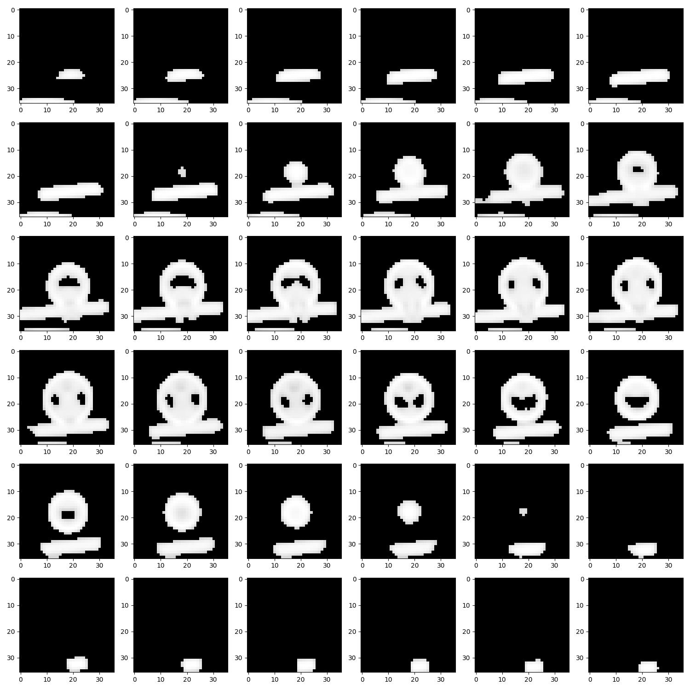
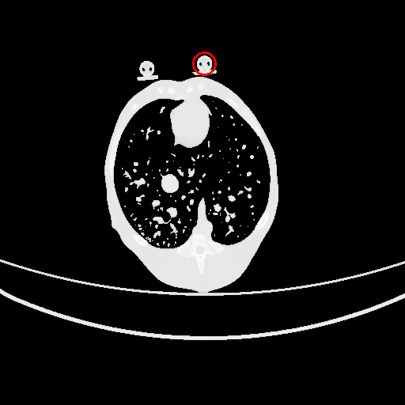

# dcm_ball_detector
给定一个 DCM 格式的图像序列，从这个图像序列中识别出所有标志物的位置。

## 前置条件

- `linux`
- `python>=3.12`
- 我们强烈建议参与标志物识别的所有 DCM 文件中的比例尺应为 `0.625mm/像素`，尽管本项目中的算法对其他的分辨率也有一定的容忍能力

## 使用指南

### 构建虚拟环境

- 按照如下步骤可以部署一个包含当前项目所有依赖的虚拟环境：

```bash
cd "当前项目的根目录"
python3 -m venv dcm_venv                        # 创建虚拟环境
source dcm_venv/bin/activate                    # 激活虚拟环境
pip install pydicom pylibjpeg pylibjpeg-libjpeg # 安装用于 DCM 文件读取的相关依赖
pip install tqdm                                # 用于展示进度条
pip install numpy                               # 
pip install matplotlib                          # 用于生成测试用例中的辅助图像，在生产环境下不需要此库
pip install scipy scikit-learn scikit-image     # scipy 以及 sklearn 的相关功能
```

### 测试展示性用例

- 如果您已经成功**按照上述步骤**配置好了虚拟环境，您可以使用如下的命令运行本项目自带的展示性测试用例：

```bash
cd "当前项目的根目录"
source dcm_venv/bin/activate # 激活虚拟环境
python3 -m dcm_ball_detector # 运行检测程序
```

- 在运行展示性用例后，您可以在 `项目根目录/dcm_ball_detector/log_image` 文件夹下看到若干张图片，这些图片即为识别到的标志物的中心时刻影像。

- 其中包含两类图片，第一类图片展示了标志物随着 CT 断层的前进，从出现到消失的过程，例如：



- 第二类图片展示了某个标志物中心点出现在 CT 断层中的那个时刻的影像，并用红色的圆将其中的标志物圈出，例如：



### 测试其他用例

- 如果您想针对自己设备上的其他 DCM 文件集合进行测试，您可以先将所有 DCM 文件放置于某文件夹中，并使用以下命令：

```bash
cd "当前项目的根目录"
source dcm_venv/bin/activate # 激活虚拟环境
python3 -c 'import dcm_ball_detector; dcm_ball_detector.svm_get_ball_centers_in_folder_and_dump_log("目标 DCM 所在的文件夹")'
```

- 例如，你可以使用如下的命令以测试本项目自带的展示性用例：

```bash
cd "当前项目的根目录"
source dcm_venv/bin/activate # 激活虚拟环境
python3 -c 'import dcm_ball_detector; dcm_ball_detector.svm_get_ball_centers_in_folder_and_dump_log("./data_sample/2023_01_03_0.625 x 0.625_501/")'
```

### 执行仅分析步骤

- 由于在实践中生成日志文件十分耗时，因此如果您只是希望找到各个标志物球的坐标而不关心日志图像，您可以使用如下命令：

```bash
cd "当前项目的根目录"
source dcm_venv/bin/activate # 激活虚拟环境
python3 -c 'import dcm_ball_detector; print(dcm_ball_detector.get_all_cluster_center_in_folder("目标文件夹"))'
```

- 例如，你可以运行如下的以测试本项目自带的展示性用例：

```bash
cd "当前项目的根目录"
source dcm_venv/bin/activate # 激活虚拟环境
python3 -c 'import dcm_ball_detector; print(dcm_ball_detector.get_all_cluster_center_in_folder("./data_sample/2023_01_03_0.625 x 0.625_501/"))'
```

- 程序将会输出类似如下的内容：

```
[{'time': 36, 'xpos': 86, 'ypos': 185}, {'time': 38, 'xpos': 80, 'ypos': 258}, {'time': 126, 'xpos': 112, 'ypos': 185}, {'time': 130, 'xpos': 105, 'ypos': 273}, {'time': 214, 'xpos': 166, 'ypos': 264}, {'time': 289, 'xpos': 202, 'ypos': 320}, {'time': 290, 'xpos': 176, 'ypos': 198}, {'time': 352, 'xpos': 212, 'ypos': 264}]
```

- 其中 `time` 表示标志物的中心在所有图像中的第几帧（编号从零开始，图像按照文件名字典序从小到大依次处理）
- 以图像的左上角为坐标原点，`x` 坐标向下，`y` 坐标向右，有序对 `(xpos, ypos)` 给出了某帧图片中坐标球中心点的近似坐标

## 有待完善的地方

- 目前仍然在标志球筛选的过程中仍有一定的假阳率，因此计划再跟据标志物从出现到消失的全过程试图进行一次 筛选以进一步降低假阳率。

